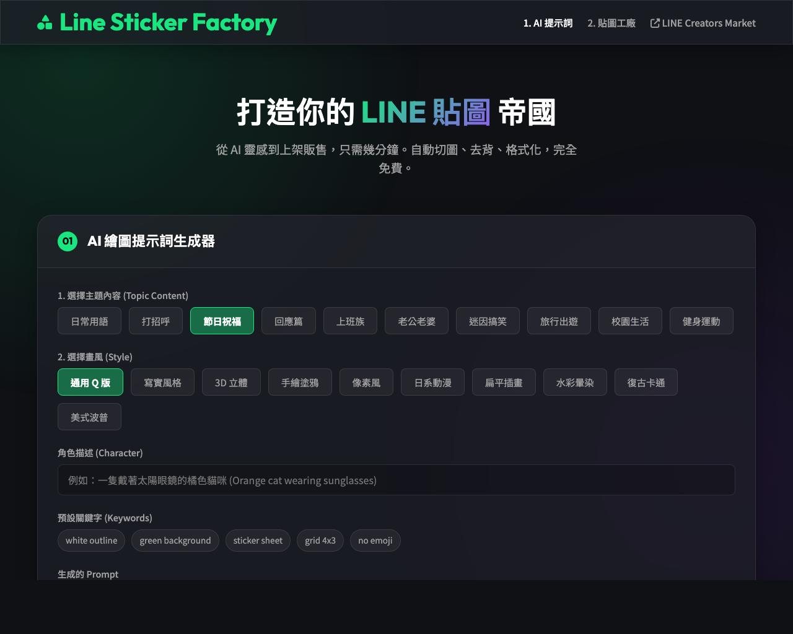

# Line Sticker Factory (LINE 貼圖自動化助手)

這是一個專為 LINE 貼圖創作者設計的 AI 輔助工具，旨在簡化從「提示詞生成」到「貼圖打包」的繁瑣流程。完全純前端運作，保障您的隱私與數據安全。

 <!-- 若有截圖可替換 -->

## ✨ 主要功能

### 1. AI 繪圖提示詞生成器 (Prompt Generator)
*   **多樣化主題**：內建 10 種情境主題（日常、節日、上班族、情侶、迷因、旅行、校園、健身...），一鍵切換 12 組不同的動作與文字設定。
*   **豐富畫風選擇**：提供 10 種精選畫風（3D Render、寫實、手繪、像素、動漫、扁平插畫、水彩、美式波普...），滿足不同創作需求。
*   **自動優化**：生成的 Prompt 專為 Google Gemini / Midjourney 優化，包含結構化的角色描述、去背友善設定（綠幕背景）與 LINE 貼圖規範（4x3 網格）。

### 2. 貼圖自動化工廠 (Image Processor)
*   **隱私保護**：所有圖片處理皆在瀏覽器端 (Client-side) 完成，不會上傳任何圖片至伺服器。
*   **智能切圖**：自動將 AI 生成的 4x3 網格大圖切割為 12 張獨立貼圖。
*   **自動去背**：內建綠幕去背演算法，可調整「容忍度」與「邊緣平滑」，輕鬆去除背景。
*   **手動挑選 Main/Tab**：直觀的預覽介面，讓您點擊星號⭐與標籤🏷️按鈕，自由指定封面圖 (Main) 與聊天室標籤圖 (Tab)。
*   **圖片大圖檢視**：支援點擊預覽圖開啟燈箱模式 (Lightbox)，仔細檢查貼圖細節。
*   **嚴格規範打包**：
    *   自動將貼圖縮放至 LINE 規範尺寸 (W 370 x H 320 max)。
    *   自動生成嚴格符合尺寸的 `main.png` (240x240) 與 `tab.png` (96x74)，確保上架無阻礙。
    *   一鍵下載標準化命名的 `.zip` 壓縮包。

## 🛠 技術棧
*   **HTML5 / CSS3 / JavaScript (Vanilla)**：輕量級、無依賴框架。
*   **JSZip**：前端壓縮打包函式庫。
*   **Glassmorphism UI**：現代化的玻璃擬態設計風格。

## 🚀 如何使用

1.  **開啟網頁**：直接用瀏覽器打開 `index.html`。
2.  **生成 Prompt**：
    *   在「AI 提示詞」區塊選擇主題與畫風。
    *   輸入角色描述（或留空以使用您上傳的參考圖）。
    *   複製生成的 Prompt 到 AI 繪圖工具（如 Google Gemini）。
3.  **上傳圖片**：
    *   將 AI 生成的 4x3 網格圖（綠底）上傳至「貼圖工廠」區塊。
4.  **編輯與打包**：
    *   調整去背參數直到底色乾淨。
    *   在預覽圖中點選一張作為 **Main**，一張作為 **Tab**。
    *   點擊大按鈕「下載貼圖包 (Zip)」。
5.  **上架**：
    *   將下載的 Zip 檔解壓縮，直接上傳至 [LINE Creators Market](https://creator.line.me/)。

## 📂 專案結構

```
line-sticker-factory/
├── index.html          # 主頁面
├── style.css           # 樣式表
├── app.js              # 應用程式邏輯 (Prompt, UI)
├── image-processor.js  # 圖片處理核心 (切圖, 去背, Zip)
└── docs/               # 專案文件
    ├── task.md
    ├── implementation_plan.md
    └── walkthrough.md
```

## 📝 授權
MIT License
